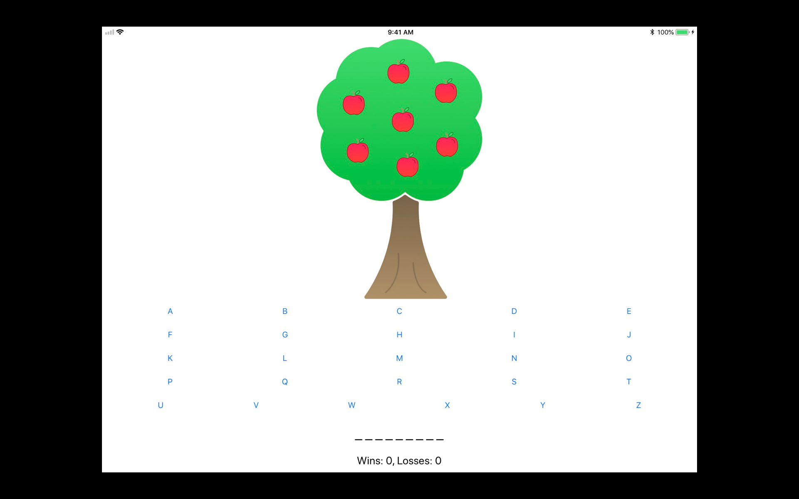
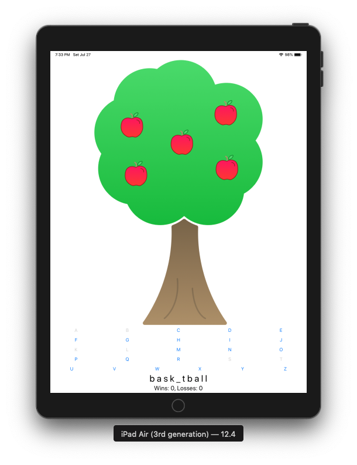

# Apple-Pie
*iOS iPad game app that is similar to Hangman.*
I created this app as a part of my learning under ***App Development with Swift***

## How the game works:
You have to guess the letters that belong to the word. For every incorrect letter guessed, an apple will fall down from the tree. Once all the apples fall down the tree you lose the round, and the game resets with a new word. 

### Main User Interface

### Round 1: Guessing the word Basketball

